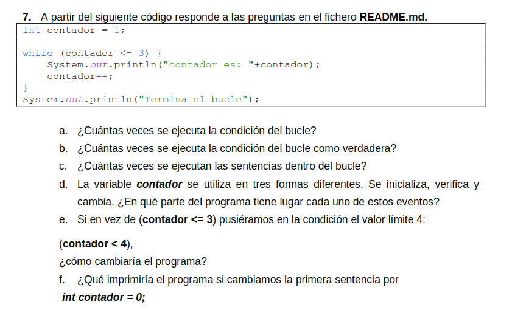
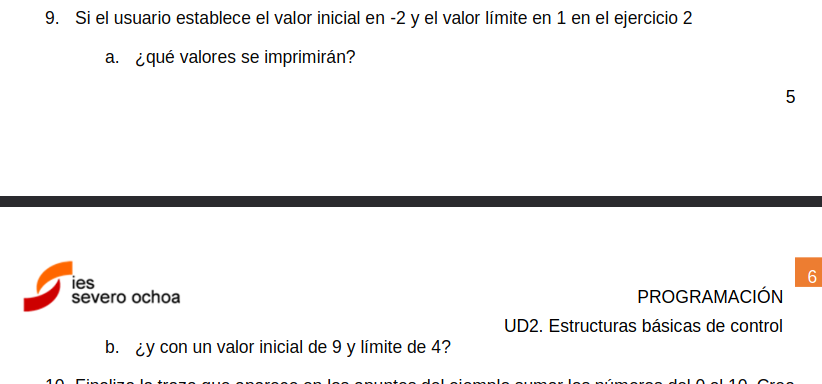
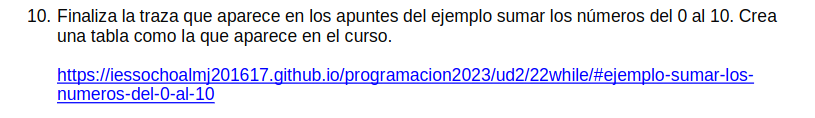

# **T02A03 Bucle While**

--- 
## Ejercicio 7

1. *El codigo se ejecuta 4 veces y cuando se cumple termina el proceso*
2. *Se da 3 veces verdadero, cuando los numeros son 1, 2 y 3.*
3. ***Inicializacion:*** *Contador se inicializa nen int contador = 1;*  
***Verificacion:*** *La condicion se verifica en while (contador <= 3);*  
***Cambio:*** *La variable cambia su valor con contador++;*
4. *No hay cambio pues es equivalente contador <= 3 a contador < 4.*
5. *Imprimiria esto:*  
   ***contador es: 0  
   contador es: 1  
   contador es: 2  
   contador es: 3  
   Termina el bucle***

---

# Ejercicio 9

1. *El programa imprimiria los siguientes valores:*  
***contador es: -2  
   contador es: -1  
   contador es: 0  
   contador es: 1***
2. *El programa no imprimiria nada pues el valor inicial seria mayor
   al valor limite.*

---

# Ejercicio 10

| Iteración | Variable            | i <= 10 | Acción                         |
|-----------|---------------------|---------|--------------------------------|
| 1a        | suma=0, i=0         | true    | suma=0, incrementa i(1)        |
| 2a        | suma=0, i=1         | true    | suma=1, incrementa i(2)        |
| 3a        | suma=1, i=2         | true    | suma=3, incrementa i(3)        |
| 4a        | suma=3, i=3         | true    | suma=6, incrementa i(4)        |
| 5a        | suma=6, i=4         | true    | suma=10, incrementa i(5)       |
| 6a        | suma=10, i=5        | true    | suma=15, incrementa i(6)       |
| 7a        | suma=15, i=6        | true    | suma=21, incrementa i(7)       |
| 8a        | suma=21, i=7        | true    | suma=28, incrementa i(8)       |
| 9a        | suma=28, i=8        | true    | suma=36, incrementa i(9)       |
| 10a       | suma=36, i=9        | true    | suma=45, incrementa i(10)      |
| 11a       | suma=45, i=10       | true    | suma=55, incrementa i(11)      |
| 12a       | suma=55, i=11       | false   | termina el bucle               |
